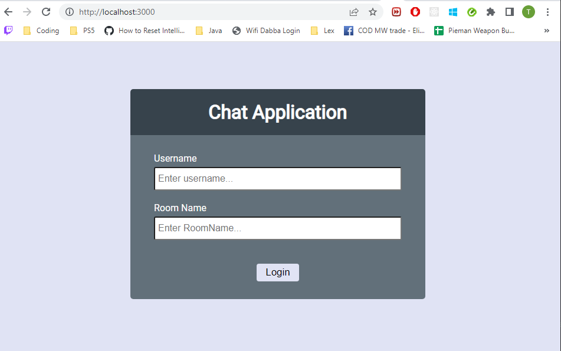
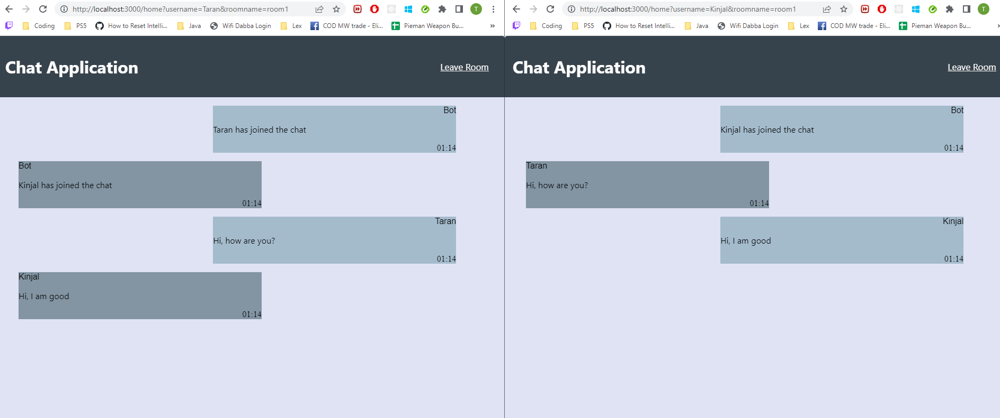

# Full-Stack-Project

BCDV1008 - Full Stack Chat Application

- Users can connect to a room and chat with the users present in the same room.
- Users can leave the room and then join different room.
- There are 3 table used to store the user, event and chat information in the mongodb server.

## Run Locally

Clone the project

```bash
  git clone https://github.com/Tarandeep100/Full-Stack-Project.git
```

Go to the project directory

```bash
  cd Full-Stack-Project
```

Install dependencies

```bash
  npm install
```

Install nodemon

```bash
  npm install nodemon
```
Install and run the mongodb

```bash
  URI: mongodb://127.0.0.1:27017
```

Start the server

```bash
  npm run start
```


## Authors

- [@Tarandeep100](https://github.com/Tarandeep100/)
- [@KinjalAshra](https://github.com/KinjalAshra)

## Screenshots





